[portfolio](https://github.com/erfanulfarhan/portfolio) &nbsp;·&nbsp;
[sitesage](https://sitesage-erfanul.vercel.app) &nbsp;·&nbsp;
[ask my docs](https://ask-my-docs-erfanul.vercel.app) &nbsp;·&nbsp;
[email](mailto:ershadul@datacenters.com)

> AI and automation developer. 
> Small tools that do one job, shipped and actually used.

Most of what I build starts as a problem I hit myself: a ticket that sells out 
before I can click, a results PDF nobody wants to read, notes I need answers 
from at 2am. I put the AI where it earns its place and write plain code for 
everything else.

<samp>python &nbsp; javascript &nbsp; typescript &nbsp; react &nbsp; node &nbsp; playwright &nbsp; fastapi &nbsp; supabase &nbsp; postgres &nbsp; vercel &nbsp; git</samp>

**[exam-toolkit](https://github.com/erfanulfarhan/exam-toolkit)** &nbsp;·&nbsp; <samp>typescript, react</samp> 
Revision tools for Edexcel International A Level and IGCSE. UMS grade calculator 
built off the published boundaries, past papers beside mark schemes that stay 
locked until you attempt the question, mock timer and study planner.

**[sitesage](https://github.com/erfanulfarhan/sitesage)** &nbsp;·&nbsp; <samp>javascript, groq</samp> 
Embeddable AI chat widget for any site. Create a bot, train it on text or URLs, 
drop in one script tag. Multi-tenant, so one deployment serves every customer.

**[ask-my-docs](https://github.com/erfanulfarhan/ask-my-docs)** &nbsp;·&nbsp; <samp>javascript, pgvector</samp> 
RAG over your own PDFs and notes, with citations back to the source. Embeddings 
run in the browser; Supabase pgvector does the search.

**[cineplex-bot](https://github.com/erfanulfarhan/cineplex-bot)** &nbsp;·&nbsp; <samp>python, playwright</samp> 
Telegram bot for Star Cineplex: live seat availability, seat-map images, and 
standing orders that book the moment tickets go on sale.

**[friday-voice](https://github.com/erfanulfarhan/friday-voice)** &nbsp;·&nbsp; <samp>typescript, react</samp> 
Aria, a browser voice assistant on the Web Speech API with Llama 3.3 70B 
behind it. No install, no native app.

**[bracu-result-watch](https://github.com/erfanulfarhan/bracu-result-watch)** &nbsp;·&nbsp; <samp>python</samp> 
Watches a university notice board and alerts by iMessage, email or Telegram the 
moment a result document appears.

Every graphic here is generated in this repository, not embedded from someone 
else's server, so nothing on the page can rate-limit or go dark. `ascii.svg` is 
a photo pushed through a character ramp by 
[`scripts/make_portrait.py`](scripts/make_portrait.py). The stat graphics and 
the section headings are drawn by [a scheduled action](.github/workflows/stats.yml) 
from the GitHub GraphQL API once a day, committing only what changed.

They animate with SMIL inside the SVG, because GitHub strips scripts from 
READMEs. The headings are images for the same reason: GitHub strips CSS too, so 
an image is the only way to put this page's own typeface on a heading.

The typeface is [JetBrains Mono](scripts/fonts), subset to just the characters 
each graphic uses and inlined as base64. That is not only for looks: the 
portrait's grid assumes an advance width of exactly 0.600 em, and a viewer whose 
default monospace is narrower would see it squeezed.

Language totals cover public repositories only. `year.svg` draws one character 
per day on a four step ramp: `:` `+` `#` `@`, quiet to loud.

Built with the approach in <a href="https://agreeable-credit-859.notion.site/A-GitHub-profile-that-generates-itself-3abedfe9a65a81e4afc9daed90cb4e7e">A GitHub profile that generates itself</a>. Portrait pipeline and stat generator adapted from <a href="https://github.com/andriidrok1/andriidrok1">andriidrok1/andriidrok1</a>.
